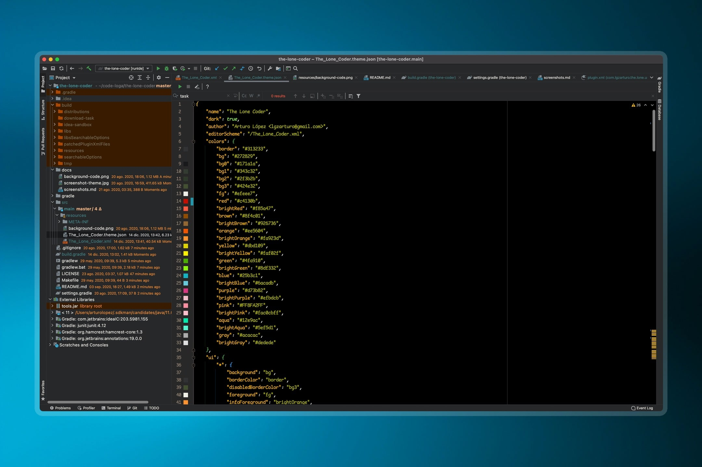

# 👨🏻‍💻 The Lone Coder Theme

## Description

This theme is compatible with all [JetBrains IDEs](https://plugins.jetbrains.com/plugin/14906-the-lone-coder):

AppCode | CLion | DataGrip | GoLand | Intellij IDEA | PhpStorm | PyCharm | Rider | RubyMine | WebStorm

Also, this theme is available for [VSCode](https://marketplace.visualstudio.com/items?itemName=lgzarturo.the-lone-coder-vscode)

😎 I recommend use a font family [Fantasque Sans Mono](https://github.com/belluzj/fantasque-sans)

👍🏻 Happy coding!

## Links

- [Screenshots](docs/screenshots.md)
- [Background](https://raw.githubusercontent.com/lgzarturo/the-lone-coder/master/src/main/resources/background-code.png)
- [JetBrains Plugin](https://plugins.jetbrains.com/plugin/14906-the-lone-coder)
- [Report Bug](https://github.com/lgzarturo/the-lone-coder/issues)
- [Wiki](https://github.com/lgzarturo/the-lone-coder/wiki)
